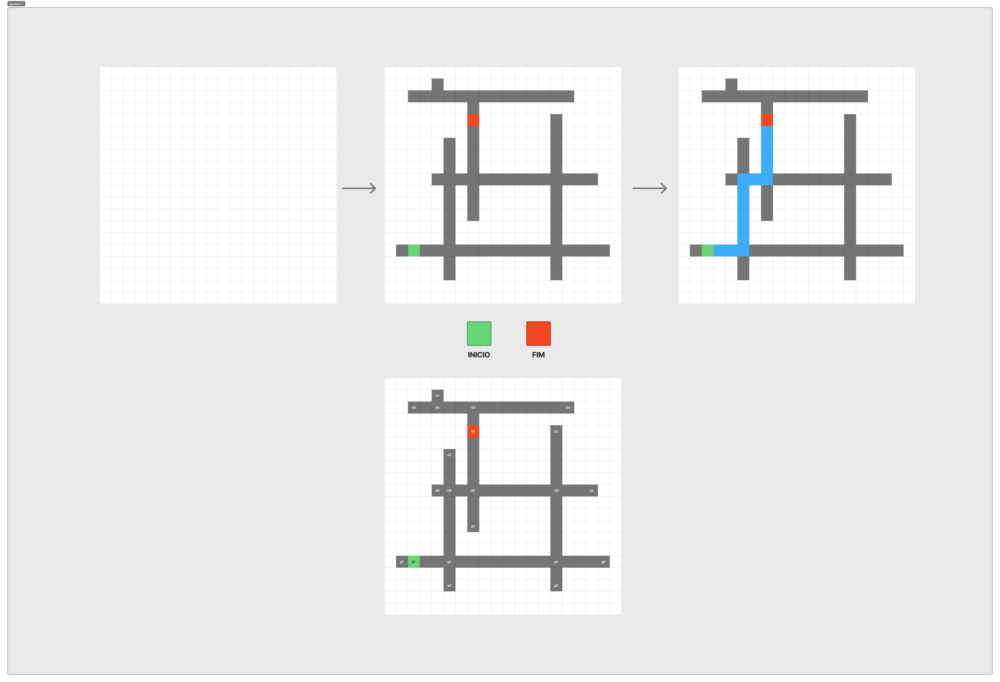

# Projeto de Algoritmos - Grupo 15

Repositório dedicado ao primeiro trabalho da disciplina de Projeto de Algoritmos (PA), ministrada pelo professor Maurício Serrano na UnB.

## Sobre o Projeto

A ideia do projeto é um visualizador/jogo em grid onde o usuário consegue desenhar caminhos e labirintos de forma livre na tela, definindo um ponto inicial e um ponto final. Ao acionar a busca, a aplicação executa o algoritmo para encontrar e destacar a menor rota entre a origem e o destino.

## Protótipo Inicial (Figma)

### Como funciona a dinâmica do jogo:

1. **Grid em branco:** O usuário inicia com uma malha vazia para montar o cenário.
2. **Construção do mapa:** É possível desenhar as paredes/caminhos (em cinza), além de definir a posição de **Início** (quadrado verde) e **Fim** (quadrado vermelho).
3. **Execução e Resolução:** 
   * A aplicação processa a estrutura do labirinto e calcula o caminho mais curto.
   * O menor caminho encontrado é renderizado em destaque (em azul).
   * A visualização também mostra a ordem/índices dos passos percorridos ao longo do grafo gerado no grid.