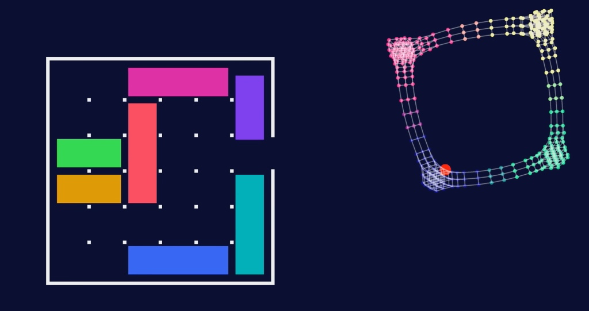

# Inspiração e Conceito

Este projeto foi inspirado nas pesquisas e visualizações sobre teoria dos grafos aplicadas a quebra-cabeças do canal **2swap**.

---

## Vídeo de Referência

<iframe width="100%" height="385" src="https://www.youtube.com/embed/YGLNyHd2w10" title="I Solved Klotski" frameborder="0" allow="accelerometer; autoplay; clipboard-write; encrypted-media; gyroscope; picture-in-picture" allowfullscreen></iframe>

---

## Rush com Grafos

A principal sacada do projeto veio do conceito que poderiamos modelar o **jogo** com um **grafo**

* **Nós (Nodes):** Cada posição válida do tabuleiro 6x6 representa um nó.
* **Arestas (Edges):** Cada movimento válido de um bloco conecta dois nós adjacentes.